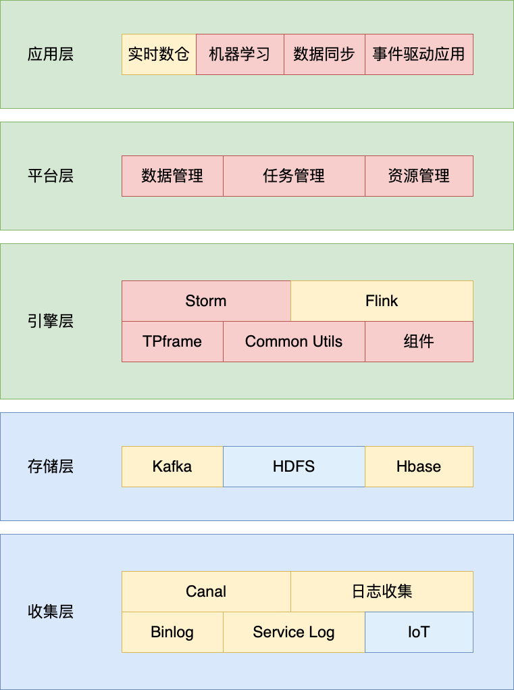
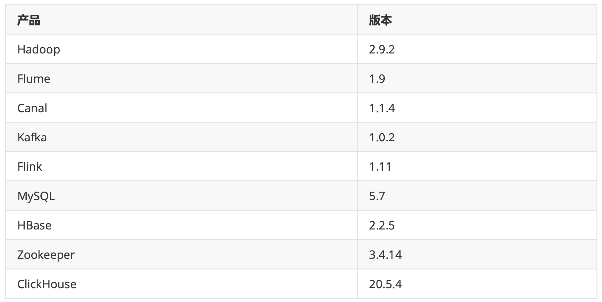
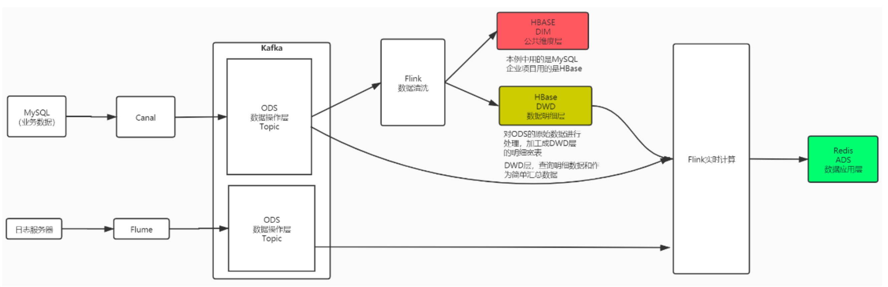

# 电商行业实时数仓项目
### 实时计算架构

- 收集层

  Binlog(业务日志)、loT(物联网)、后端服务日志(系统日志) 经过日志收集团队和 DB 收集团队的处理，数据将会被收集到 Kafka 中。这些数据不只是参与实时计算，也会参与离线计算。

- 存储层

  - Kafka:实时增量数据
  - HDFS:状态数据存储和全量数据存储(持久层)
  - HBASE: 维度数据存储

- 引擎层

  实时处理框架

- 平台层

  数据、任务和资源三个角度去管理—集群资源

- 应用层

  底层架构的应用场景

### 技术选型

数据采集:Flume、Canal
数据存储:MySQL、Kafka、HBase、Redis
数据计算:Flink
OLAP: ClickHouse、Druid 框架

#### 系统逻辑架构

### 实现的功能

1. 查询城市、省份、订单总额、订单总数----全量查询
2. 每隔5分钟统计最近1小时内的订单交易情况，要求显示城市、省 份、交易总金额、订单总数---增量统计
3. 每隔5秒统计最近1小时内广告的点击量---增量
4. 黑名单用户ID、广告ID、点击数
5. 实时统计各渠道来源用户数量
6. 交易支付异常

